# Exercise 1: Microsoft Foundry Fundamentals

### Estimated Duration: 20 Minutes

## Lab Overview

This hands-on lab provides experience with Microsoft Foundry and its core capabilities, including AI model deployment and integration with Azure AI Search. Designed for those new to the platform, the lab guides you step-by-step to set up an AI project, deploy a GPT-4o model, and configure essential AI services.

You will explore Microsoft Foundry to create and manage AI projects, use Models + Endpoints to deploy base models, and leverage Azure AI Search for scalable, efficient data retrieval. Ensure all prerequisites are met before starting, as the cloud-based Microsoft Foundry platform allows you to complete the lab remotely.

## Lab Objectives

In this exercise, you will complete the following tasks:

- Task 1: Set up Microsoft Foundry

- Task 2: Create Azure AI Search

## Task 1: Set up Microsoft Foundry

In this task, you will explore different flow types in Microsoft Foundry by creating a AI hub through Azure portal, then deploying the GPT-4o model, and testing its capabilities in the playground from the Microsoft Foundry.

1. On the **Azure portal**, search for **Microsoft Foundry (1)** and select **Microsoft Foundry (2)** from the results.

    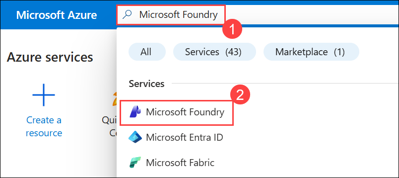

1. From the left navigation pane, expand **Use with Foundry (1)**, select **AI Hubs (2)**, open the **Create (3)** drop-down, and click **Hub (4)**.

    

1. On the **Azure AI hub** page, provide the following details and then click on **Review+create (5)**:

    - **Subscription**: Leave the default one **(1)**

    - **Resource group:** Select **ai-foundry-<inject key="Deployment ID" enableCopy="false"></inject> (2)**

    - **Region:** Select **<inject key="Region" enableCopy="false"></inject> (3)**

    - **Name:** Enter **ai-foundry-hub-<inject key="Deployment ID" enableCopy="false"></inject> (4)**

      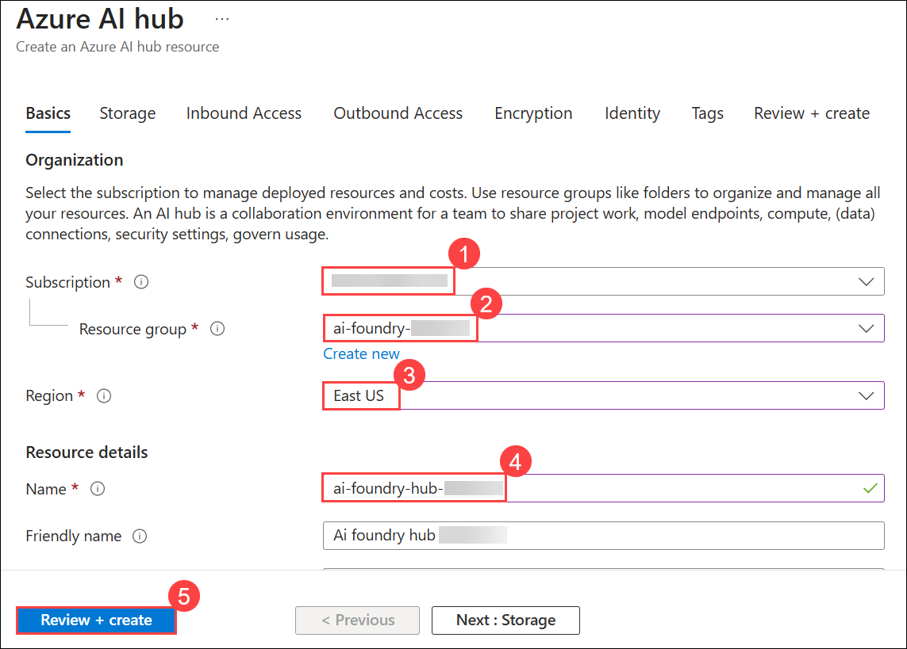

1. Once the Validation passed, click on **Create**.

    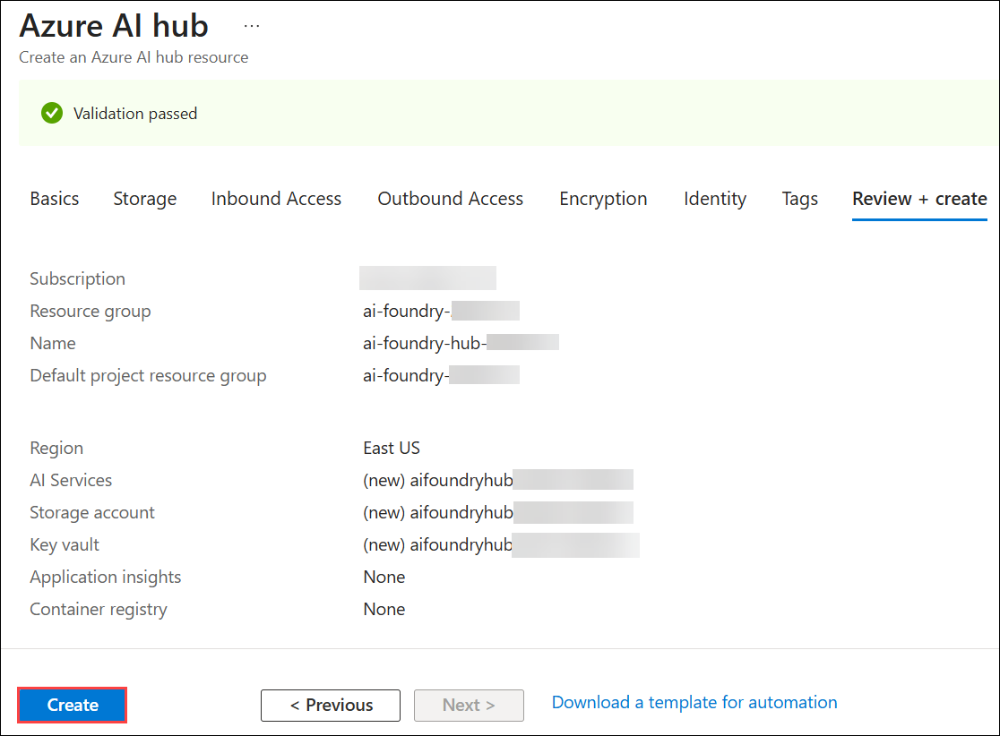

1. Once the deployment is completed, click on **Go to resource**.

    

1. From the **Overview** page of the **Azure AI hub**, click **Launch Azure AI Foundry** to open the Foundry workspace.

    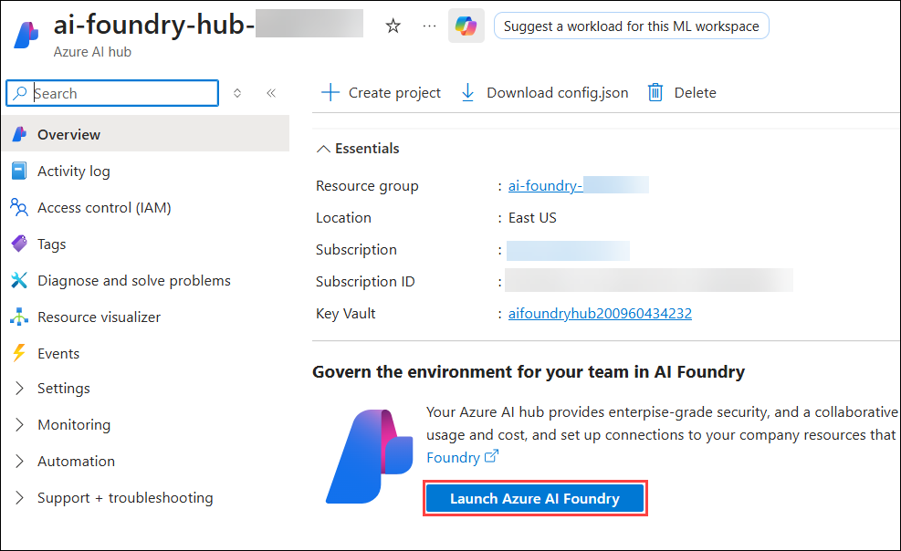

1. From the left navigation pane, select **Model + endpoints (1)**, then click on **+ Deploy model (2)** drop-down and click **Deploy base model (3)**.

    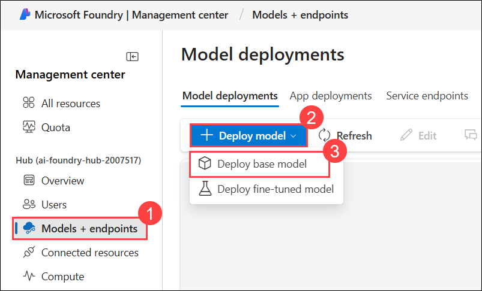

1. Search for **gpt-4o (1)**, select the **gpt-4o** model **(2)**, and click on **Confirm (3)**.

    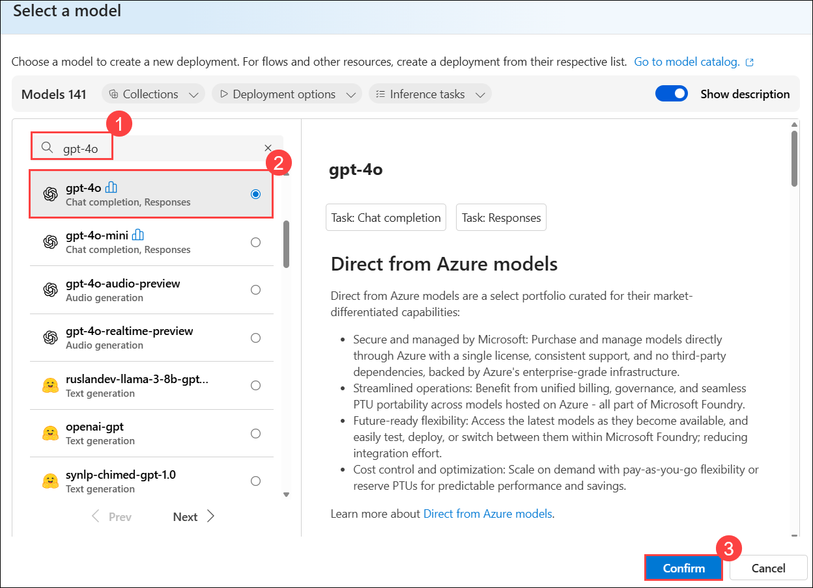

    >**Note**: If you are not able to deploy the following model in your Microsoft Foundry **"gpt-4o"**, please use the alternative model **"gpt-4o-mini"**, which is a replacement for GPT-4o. These models are fully compatible with the lab exercises and will allow you to complete all steps without issues

1. On the **Deploy gpt-4o** blade, configure the required deployment settings as specified below:

    - **Deployment type**: Choose **Standard (1)** 
    
    - **Model version**: Select **2024-08-06 (Default) (2)**

    - **Tokens per Minute Rate Limit**: Limit to **50K (3)**

    - Click on **Connect and deploy (4)**

      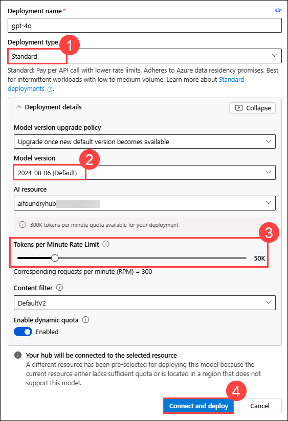 

1. From the top, click on **Microsoft Foundry**.

     

1. Select the listed **aifoundryhubxxxxxx** resource to continue working in **Microsoft Foundry**.

    

     >**Note**: **xxxxx** refers to randomly generated suffix.

1. From left navigation pane, select **Model + endpoints (1)**, then select **gpt-4o (2)** model and the click on **Open in Playground (3)**.

    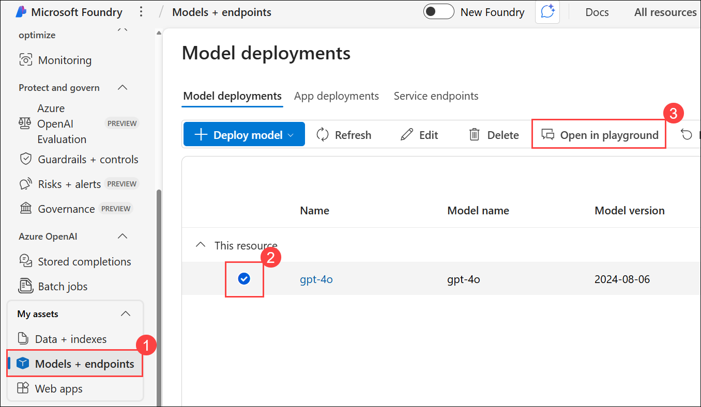

1. Replace the existing text with `Extract the United States Postal Service (USPS) formatted address from the following email` **(1)** then click on **Apply changes (2)**. Using this you can explore the capabilities of Azure OpenAI.

    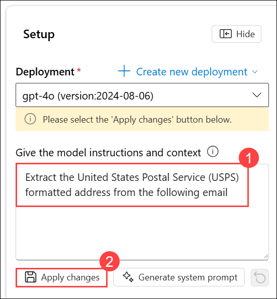

1. Click **Continue** to update the system message and start a new chat session.

    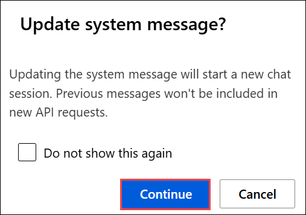

1. Provide the below mail in the chat **(1)** then click on **Send (2)** to identify and extract the postal address from the following email:

    ```
    Subject: Elevate Your Brand with Our Comprehensive Marketing Solutions!
    From: BrightEdge Marketing
    To: John Doe

    Dear John,
    At BrightEdge Marketing, we believe in the power of innovative marketing strategies to elevate brands and drive business success. Our team of experts is dedicated to helping you achieve your marketing goals through a comprehensive suite of services tailored to your unique needs.

    Please send letters to 123 Marketing Lane, Suite 400, in area 90210, Innovation City, California.

    Thank you for considering BrightEdge Marketing.
    Best regards,
    Sarah Thompson
    Marketing Director BrightEdge Marketing
    ```

    
    
1. You will receive a response similar to the one shown below:

    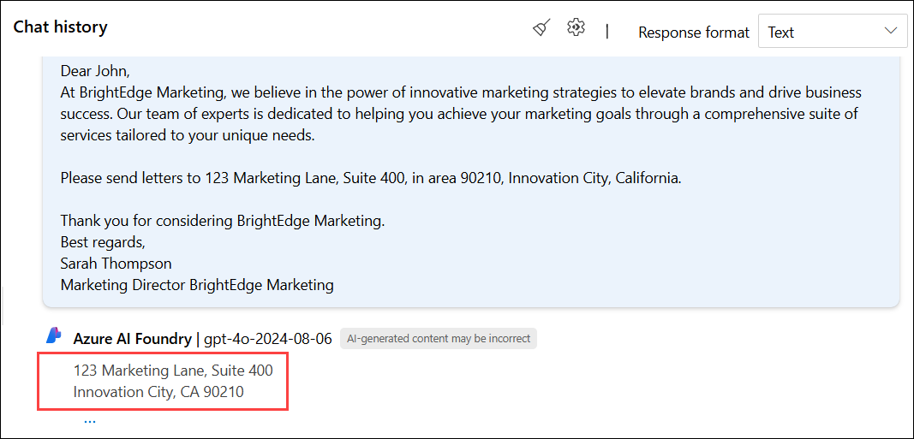

## Task 2: Create Azure AI Search

In this task you will create a Azure AI Search resource.

1. Navigate back to the **Azure portal**.

1. On the search bar, search for **AI Search (1)** and select **AI Search (2)** from the results.

    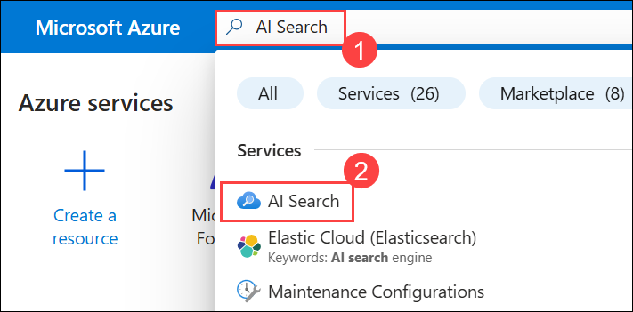

1. From the left navigation pane, ensure **AI Search (1)** is selected and then click on **+ Create (2)** from the top menu bar.

    

1. On the **Create a search service** page, provide the following details and then click on **Review+create (5)**:

    - **Subscription:** Leave the default one **(1)**

    - **Resource group:** Select **ai-foundry-<inject key="Deployment ID" enableCopy="false"></inject> (2)**

    - **Service name:** Enter **ai-search-<inject key="Deployment ID" enableCopy="false"></inject> (3)**

    - **Region:** Select **<inject key="Region" enableCopy="false"></inject> (4)** 

      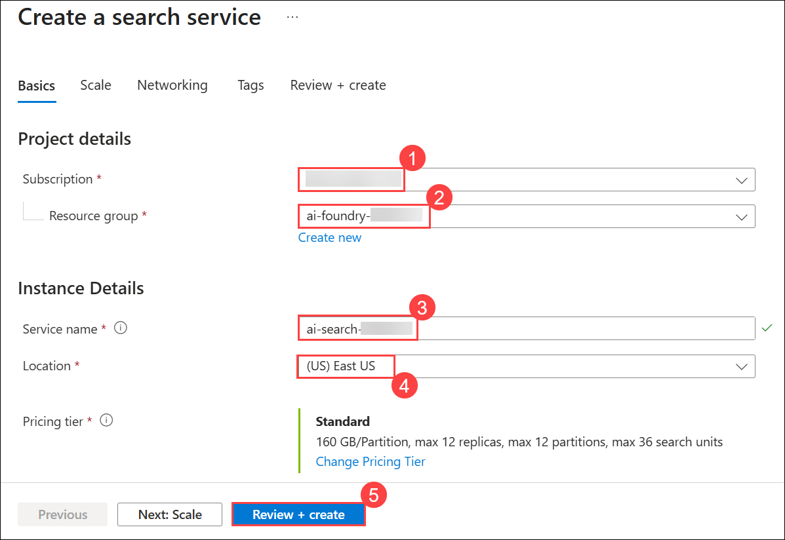

1. Click **Create** to deploy the search service.

    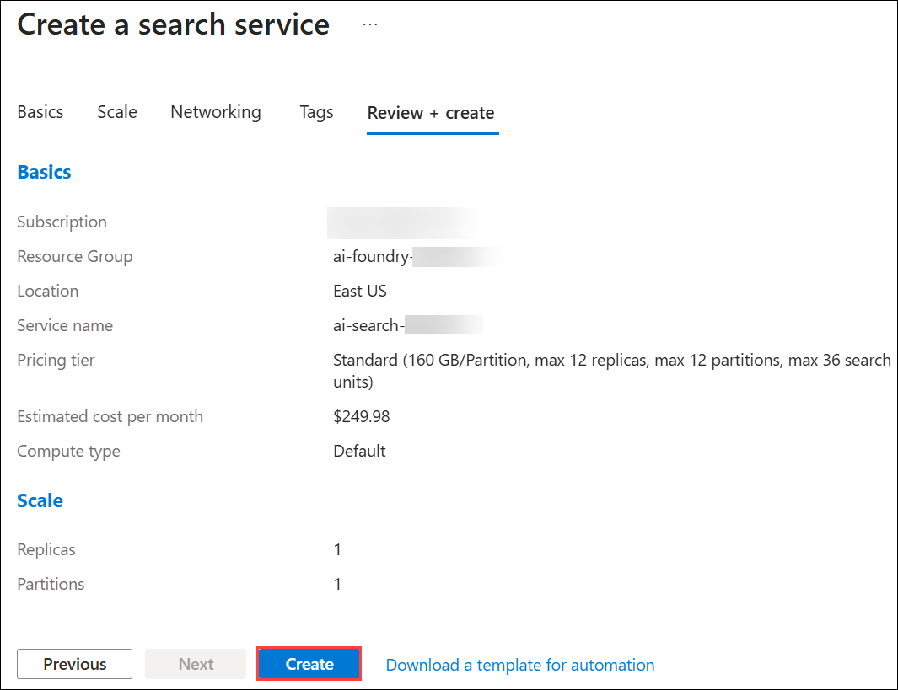

  > **Congratulations** on completing the lab! Now, it's time to validate it. Here are the steps:
  > - Hit the Validate button for the corresponding task. If you receive a success message, you can proceed to the next  task. 
  > - If not, carefully read the error message and retry the step, following the instructions in the lab guide.
  > - If you need any assistance, please contact us at cloudlabs-support@spektrasystems.com. We are available 24/7 to help
 
<validation step="a3e77878-3ce2-4d69-b4e6-c88d4a0f45ec" />

## Review

In this exercise, you have completed the following:

- Set up Microsoft Foundry.

- Created Azure AI Search.

### You have successfully completed this exercise. Kindly click **Next >>** to proceed further


