# Exercise 6: Responsible AI: Exploring Content Filters in Azure AI Foundry

### Estimated Duration: 25 Minutes

## Lab Overview

This hands-on lab introduces content filtering in Azure AI Foundry to help you build safer, more responsible AI applications.
You will learn to apply built-in filters, adjust settings, and create custom rules to block unwanted content—all within Azure AI Foundry Studio.

## Lab Objectives

In this exercise, you will complete the following tasks:

- Task 1: Adjust Filter Settings

- Task 2: Filter specific words or patterns

## Task 1: Adjust Filter Settings

In this task, you will explore different flow types in Azure AI Foundry by adjusting filter settings to refine search results and improve query accuracy.

1. Navigate to the [Microsoft Foundry](https://ai.azure.com/) portal.

1. Select the listed **aifoundryhubxxxxxx** resource to continue working in **Microsoft Foundry**.

    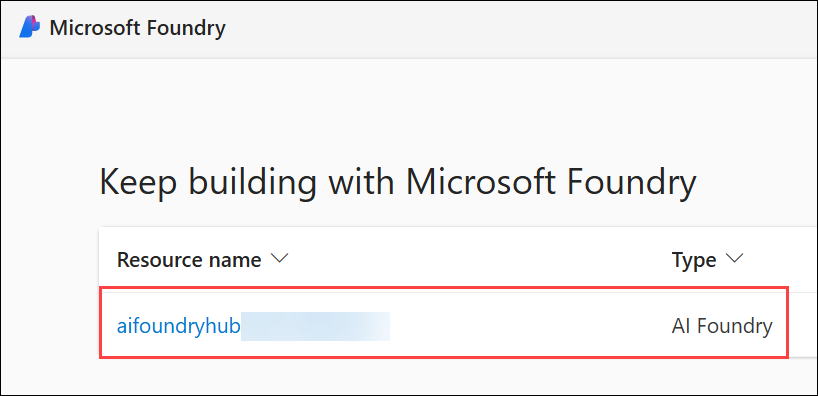

1. From the left navigation pane, click on **Guardrails + controls (1)**. Select **Content filters (2)** tab from the top menu bar and click **+ Create content filter (3)**.

    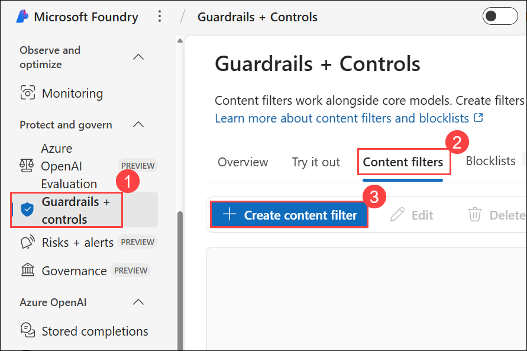

1. On the **Add basic information** blade, enter the Name **AggressiveContentFilter (1)** and click on **Next (2)**:

     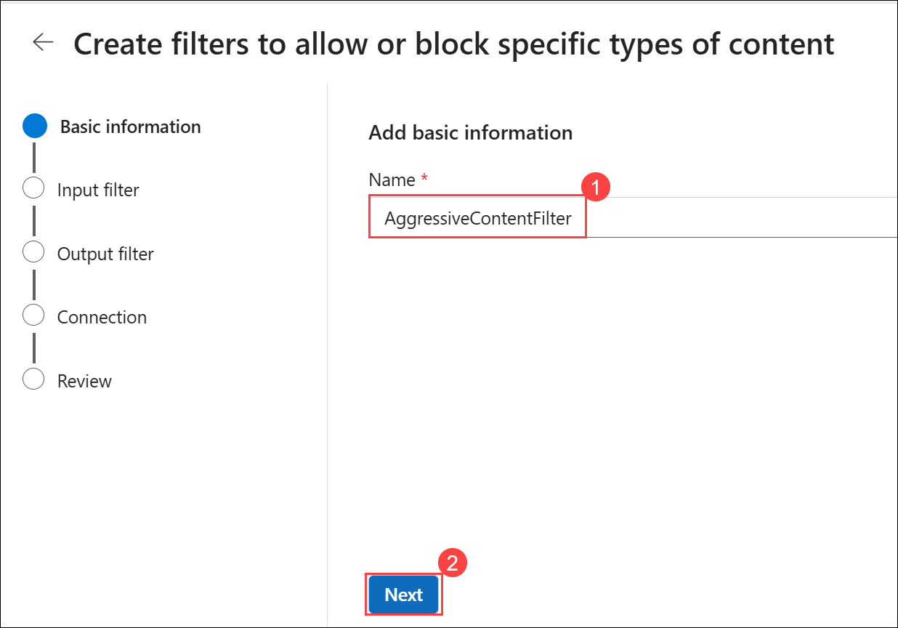

1. Leave the **Input filter** and **Output filter** blade to default and click on **Next**.

1. On the **Apply filter to deployments (optional)** page, select **both deployments (1)** and click **Next (2)** to continue.

    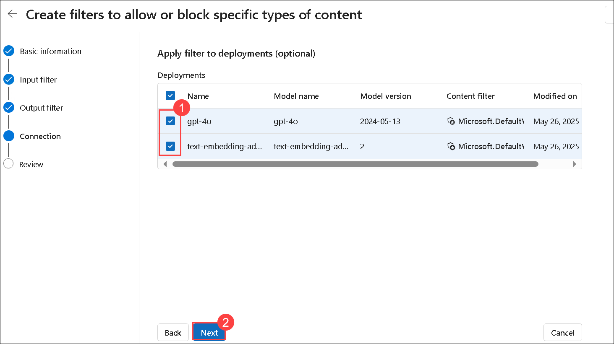

1. If you get a **Replacing existing content filter** warning, click on **Replace**.

    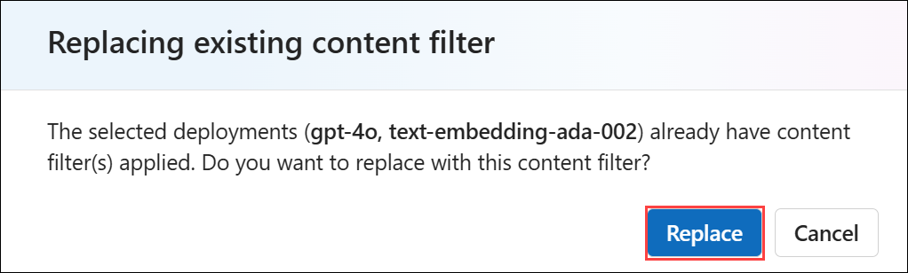

1. Review the content filter configuration and click **Create filter** to complete the setup.

    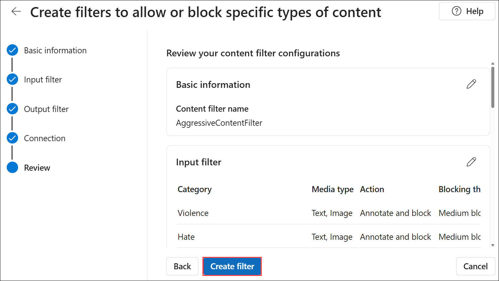

## Task 2: Filter specific words or patterns

In this task, you will explore different flow types in Azure AI Foundry by filtering specific words or patterns to refine search results and enhance data relevance.

1. From the top menu bar, select **Blocklists (Preview) (1)** tab and then click **+ Create blocklist (2)**.

    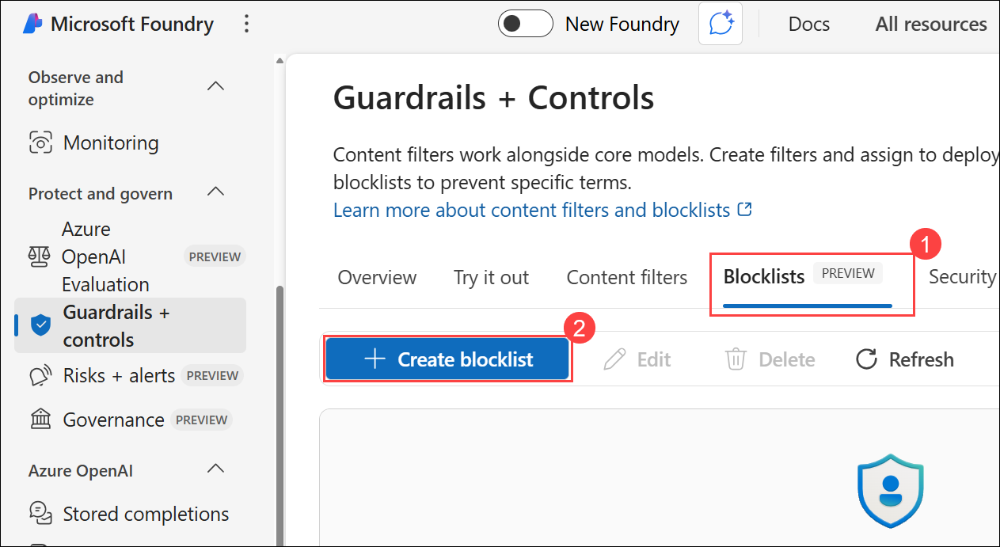
    
1. On the **Create a blocklist** blade, specify the following configuration options and click on **Create blocklist (3)**.

    - **Name**: Enter **CustomBlocklist<inject key="Deployment ID" enableCopy="false"></inject> (1)**

    - **Description**: `This is a custom blocklist.` **(2)**

      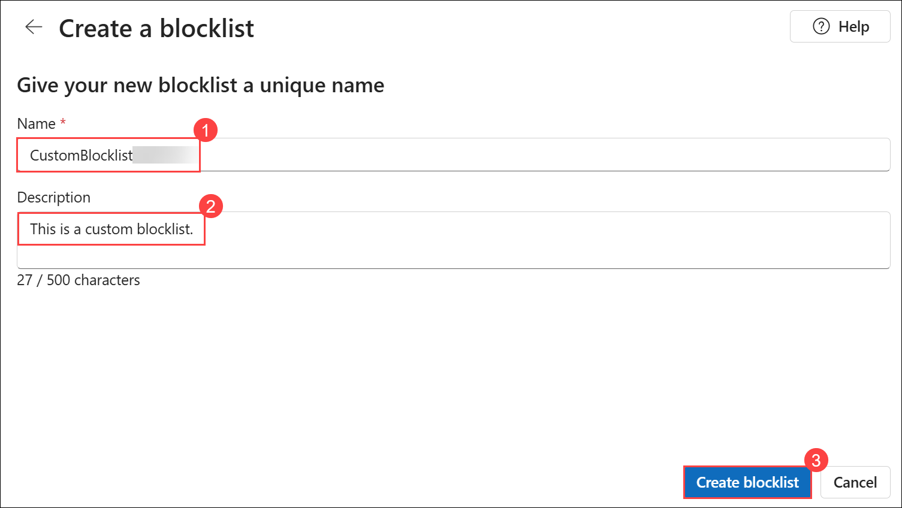

1. Click on **CustomBlocklist<inject key="Deployment ID" enableCopy="false"></inject>** created earlier.

    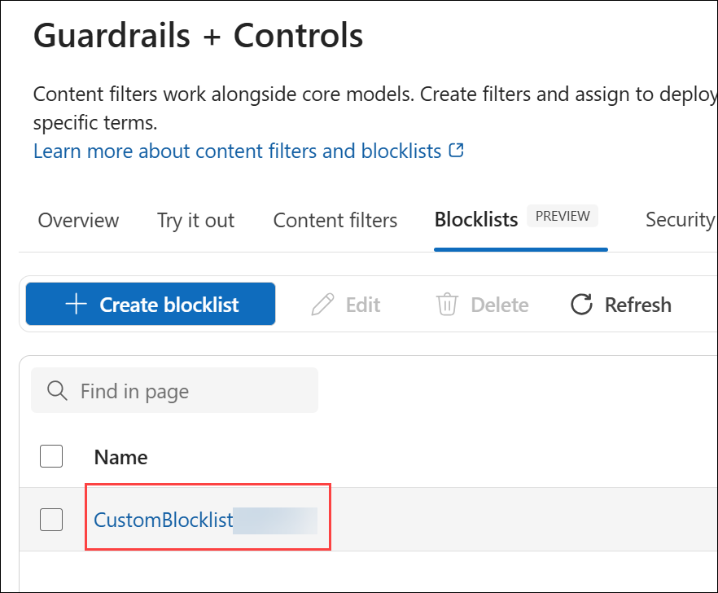

1. Fromt the top menu bar, click on **+ Add new term**.

    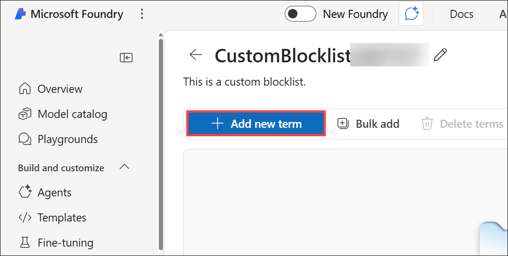

1. Enter **password (1)** as the term, select the type **Exact Match (2)** or **Regex** as required, and click **Add term (3)** to save it.

    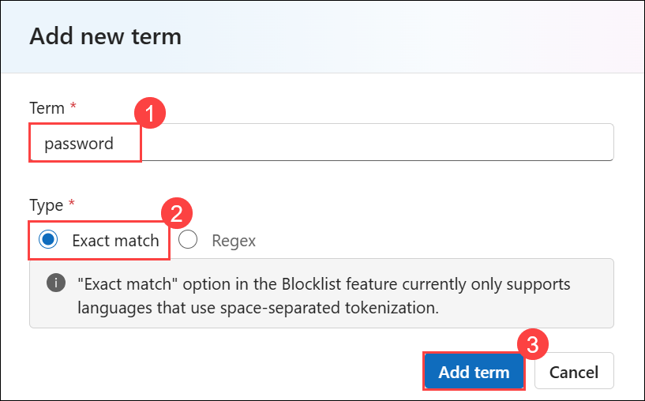

1. Click on **+ Add new term** again.   

    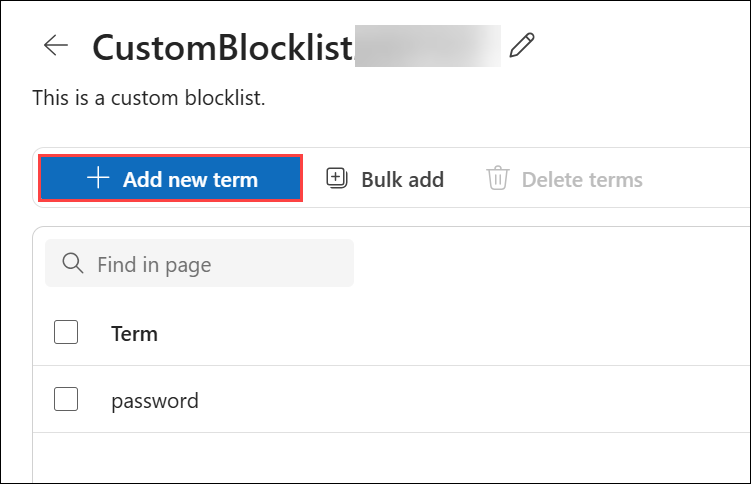

1. Repeat the step for the following and select the type as required (**Exact Match** or **Regex**):-

    - credentials
    - exploit
    - hack
    - keylogger
    - phishing
    - SSN
    - credit card
    - bank account
    - CVV
    - casino
    - poker
    - betting

      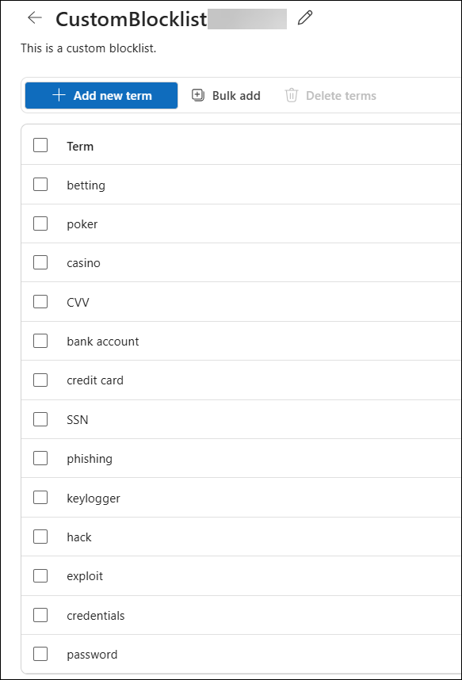

## Review

In this exercise, you have completed the following:

- Adjusted filter settings.

- Filtered specific words or patterns.

### You have successfully completed this exercise. Kindly click **Next >>** to proceed further

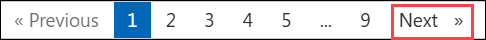
